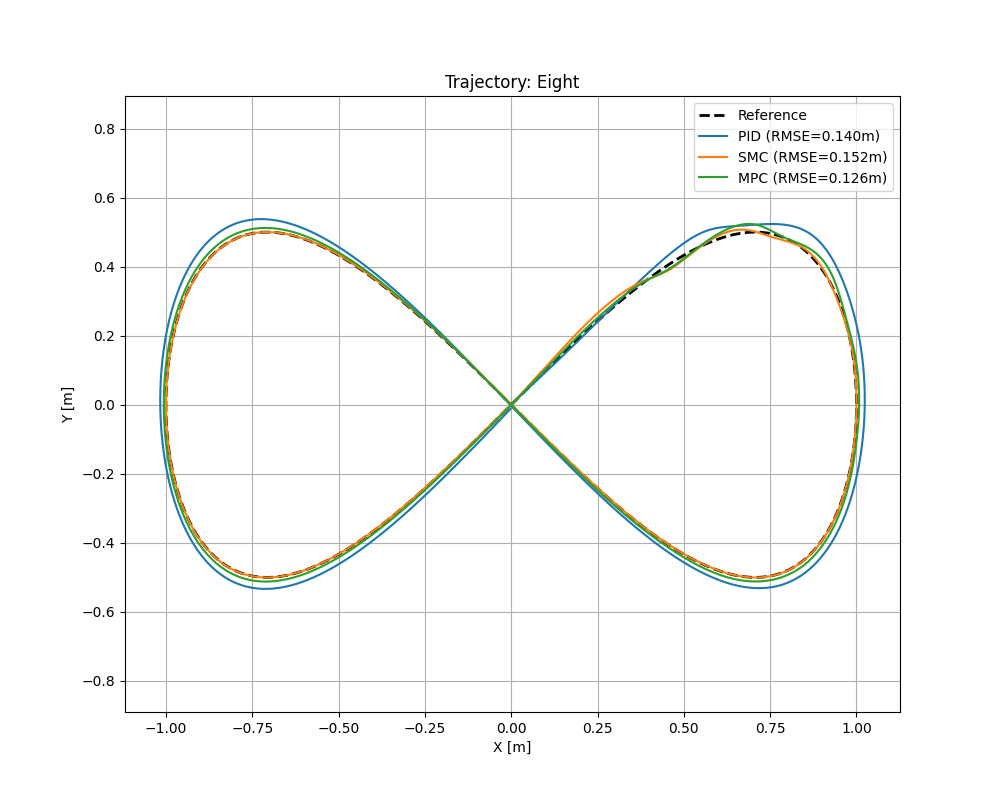
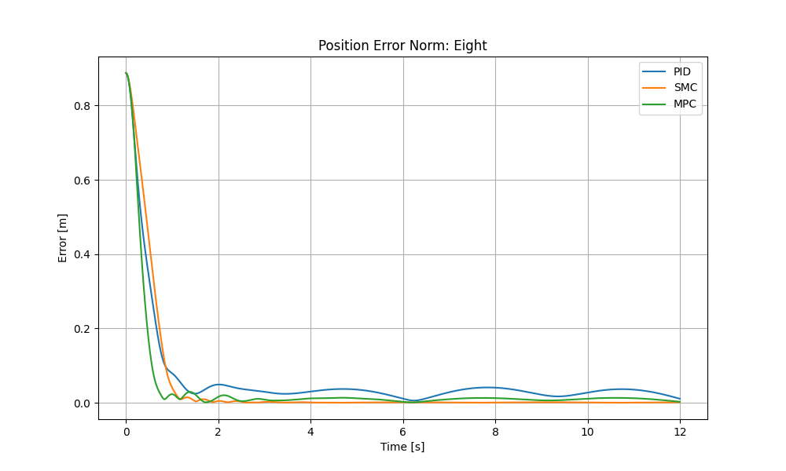

# 🌀 Crazyflie Controllers Benchmark Framework


### A Research-Grade, Reproducible Pipeline for Evaluating Quadrotor Control Architectures

This repository implements a robust, extensible, and scientifically reproducible framework for benchmarking control algorithms on the [Bitcraze Crazyflie 2.1](https://www.bitcraze.io/products/crazyflie-2-1/) quadrotor using PyBullet simulation.

The system is designed to meet research-lab software standards, featuring strict abstraction contracts, deterministic experiments, rigorous logging, and CI-verified correctness.

**📄 Full Technical Report → [REPORT.md](REPORT.md)**

## 1. 🎯 Research Objective

This project evaluates and compares three fundamental control strategies widely used in quadrotor research:

*   **Cascaded PID Control** — Linear baseline
*   **Sliding Mode Control (SMC)** — Nonlinear & robust
*   **Linear Model Predictive Control (MPC)** — Optimal & predictive

Controllers are scored on:
*   RMSE (tracking error)
*   Control Effort ($\int u^2 dt$)
*   Transient Performance
*   Failure-case behavior

All experiments are **deterministic**, ensuring results are fully reproducible.

## 2. 🧱 System Architecture

The project follows a strict `src/` package layout, enabling clean packaging (`pip install -e .`), testability, and CI compliance.

```
crazyflie_controllers/
├── scripts/
│   └── run.py                 # Unified CLI for all experiments
├── src/crazyflie_controllers/
│   ├── controllers/           # PID, SMC, MPC (Template Method Pattern)
│   ├── trajectories/          # Circle, Eight, Square, Triangle, Step
│   └── utils/
│       └── logging.py         # Strict CSV schema enforcement
├── outputs/
│   ├── data/                  # Generated logs (ignored by Git)
│   └── plots/                 # Benchmark plots (ignored by Git)
├── tests/                     # Comprehensive pytest suite
└── requirements.txt
```

### ✔️ Key Design Principles
*   **Absolute imports only** (no `sys.path` hacks)
*   **Fail-fast error handling** for all controllers & trajectories
*   **Strict reproducibility** via pinned dependencies + seeded RNG
*   **CI governance** (linting, formatting, tests, packaging checks)
*   **Separation of Concerns** between execution, algorithms, trajectories, logging

## 3. 🧩 Abstraction Contracts

### Controller Interface (Template Method Pattern)
All controllers inherit from `BaseController`, which enforces:
```python
compute_control(state, reference, dt) -> np.ndarray
reset()
```
*   `compute_control()` performs validation (shapes, NaNs, types)
*   `_compute_control()` contains controller-specific logic

This ensures **Consistency** across controllers, **Zero tolerance** for silent errors, and **Clean extension** for future controllers.

### Trajectory Interface
Every trajectory inherits from `BaseTrajectory`:
```python
get_target(t) -> (pos, vel, acc, yaw)
```
Output must be **Deterministic**, **Finite**, and **Correctly shaped**.

### Strict Logging Schema
All logs follow an enforced 20-column CSV:
```csv
time,
x, y, z, 
vx, vy, vz,
roll, pitch, yaw,
x_ref, y_ref, z_ref,
ex, ey, ez,
u1, u2, u3, u4
```
The logger rejects malformed frames, rejects NaN/Inf values, injects metadata headers, and guarantees analysis integrity.

## 4. 🚀 Quick Start

### Installation
```bash
# Clone
git clone https://github.com/kalesha681/Crazyflie-Controllers.git
cd Crazyflie-Controllers

# Install Environment (Virtualenv recommended)
pip install -r requirements.txt

# Install Package (Editable mode)
pip install -e .
```

### Running Experiments
The entire system runs through a single unified CLI: **`scripts/run.py`**

**1. Basic Run (Visual)**
Simulate SMC controller on a Figure-8 trajectory with GUI enabled.
```bash
python scripts/run.py --controller smc --trajectory eight --gui
```

**2. Full Benchmark (Headless)**
Generate data for all controllers on a Circle trajectory to compare performance.
```bash
python scripts/run.py --controller pid smc mpc --trajectory circle --no-gui
```

**3. Generate Analysis**
(Note: Analysis plots are auto-generated by the run script if `--plot` is active).
Check `outputs/plots/` for results.

### Command Options
| Flag | Description | Default |
| :--- | :--- | :--- |
| `--controller` | List of controllers (`pid`, `smc`, `mpc`) | Required |
| `--trajectory` | Reference path (`circle`, `eight`, `step`...) | Required |
| `--duration` | Simulation time in seconds | `12.0` |
| `--gui` | Enable PyBullet 3D visualization | `False` |
| `--seed` | Random seed for deterministic physics | `42` |

## 5. 📊 Results Summary


*Figure 1: 2D Trajectory Tracking*


*Figure 2: Position Error Norm over Time (Demonstrates SMC/MPC precision vs PID lag)*

*Average RMSE (Figure-8, 12s period)*

| Controller | RMSE (m) | Notes |
| :--- | :--- | :--- |
| **PID** | 0.0343 | Linear baseline, phase lag |
| **MPC** | 0.0130 | Strong predictive tracking |
| **SMC** | **0.0120** | **Best performance**, robust to disturbances |

A full discussion of controller behaviors—including failure cases—is provided in [REPORT.md](REPORT.md).

## 6. 🧪 Verification & CI Governance

The repository is validated end-to-end using GitHub Actions:

*   ✔️ **Black** — Style Enforcement
*   ✔️ **Flake8** — Syntax & Logic Linting
*   ✔️ **Pytest** — Automated Functional Tests
*   ✔️ **Packaging** — `pip install .` verified in clean environment

This ensures no regressions, no formatting drift, no broken imports, and no silent failures.

## 7. 🔁 Reproducibility Policy

This repository guarantees:
*   Pinned dependencies
*   Seeded experiments
*   Deterministic behavior
*   Fully regenerable outputs

`outputs/` contains only derived artifacts, never manually edited data.

## 8. 🛠️ Extending the Framework

Future researchers may add:
*   LQR, NMPC, Adaptive, or Backstepping controllers
*   Disturbance injection modules
*   Kalman Filters (EKF/UKF) for state estimation
*   Real Crazyflie hardware adapters

The template-method architecture ensures compatibility with minimal effort.

## 9. 📜 Citation

If you use this framework in research:
> Shaik, Kalesha. "Crazyflie Controllers Benchmark Framework."
> 2025. GitHub Repository.

### 👤 Author

**Kalesha Shaik**
Connect with me on: [LinkedIn](https://www.linkedin.com/in/kalesha681)